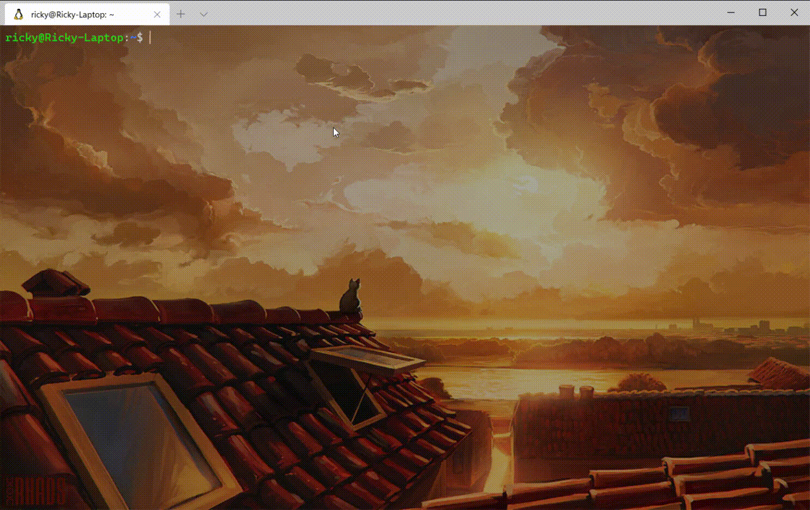

# 录制终端回放

你是否曾经遇到过这样的情况：在终端中进行操作的时候遇到各种报错，向别人求助的时候费了半天劲却没法清楚描述问题？别担心，Linux内置的终端录制程序可以简单快速地录制终端操作过程和输出结果，帮别人快速了解你的操作过程。

## 准备工作

录制过程需要`script`，播放则需要`scriptreplay`，大多数Linux发行版中应该已经默认安装了。可以用如下命令验证是否已经安装：

```shell
script -V
scriptreplay -V
```

## 开始录制

可以执行如下命令：

```shell
script -t 2>test.timefile -a test.txt
```

该命令的意思是开始录制命令，将时序信息记录在`test.timefile`中，以及将输出信息记录在`test.txt`文件中。当然，你可以根据自己的喜好自定义文件名。

命令执行之后会出现这样一行显示：

```shell
Script started, file is test.txt
```

此后你在该终端中的所有指令及其输出都会被记录下来。

常用参数选项如下：

* `-t`：指定输出录制的时间
* `-a`：指定录制存储文件，并以追加方式在文件后面添加新内容
* `-c`：直接执行命令，而非交互式的shell
* `-q`：让script命令以静默方式运行

更多参数可以使用`man script`命令查看。

开始录制之后可以先输出一个hello world测试一下：

```shell
$ echo hello, world!
```

录制完成之后输入`exit`或使用快捷键`Ctrl+D`结束录制。

## 播放回放

在终端输入如下命令可以播放刚才操作的回放：

```shell
scriptreplay test.timefile test.txt
```

其他常用参数如下：

* `-t`：指定时序文件
* `-s`：指定script的终端输出文件
* `-d`：指定播放倍速

更多参数同样可以输入`man scriptreplay`查看。

## 动图演示

上述过程动图演示如下：



## 回放分享

前文已经说过，回放的时序信息和输出信息分别在 `test.timefile` 和 `test.txt` 文件中，因此只要将这两个文件分享给对方，别人就可以在终端里复现你的问题并提供帮助。

## 总结

这个工具的原理和很多游戏中的录像功能原理是类似的，使用了两个文件分别记录时序和指令输出，回放时实际上是按照时间线读取文件中的输出信息。

这种方法生成的回放文件体积小，适用于不同平台，合理使用可以很好地解决求助时双方跨频交流的问题。
