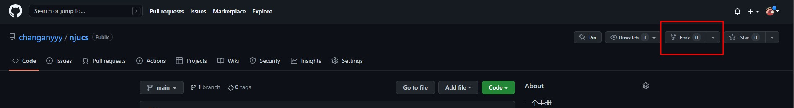

# 贡献文章

## How to Contribute <a href="#how-to-contribute" id="how-to-contribute"></a>

任何想要为学弟学妹答疑解惑的同学（不限年级），都可以向[这个github仓库](https://github.com/changanyyy/njucs)提交Pull Request（请提前联系一下[我们](gong-xian-wen-zhang.md#cang-ku-guan-li-yuan)）。

在贡献文章之后，我们会给予你丰富的志愿时长（如果你需要的话）。

您可以先对仓库进行fork，在本地（或同步到gitbook.com）进行编辑之后，提交Pull Request。

### 直接参与 <a href="#zhi-jie-can-yu" id="zhi-jie-can-yu"></a>

您可以在 [Issue](https://github.com/NJUCS-Peers-Tutors/NJUCS-FAQs/issues) 区直接回答同学提出的问题，本项目维护者会为您整理并通知您。

如果您就某一问题/话题有经验、分享、想说的话，可以直接在 Issue 区新建问题，我们会为您整合。

## Gitbook 安装 <a href="#gitbook-an-zhuang" id="gitbook-an-zhuang"></a>

为了安装 gitbook，首先需要 npm 包管理器。在 [node 官网](https://nodejs.org/en/download/) 可以获取 Node.js 和 npm 的安装包。（其实网上好多教程）

全局安装 gitbook-cli

```bash
$ npm install -g gitbook-cli
$ gitbook -V
```

更多操作可以参考这里我写的一份gitbook从开箱到使用[教程](https://lawrshen.github.io/post/wsl-gitbook/)。

## 手册如何发布 <a href="#github-cao-zuo-liu-cheng" id="github-cao-zuo-liu-cheng"></a>

本手册通过华为云服务器部署，**每次向 main 分支提交 Pull Request** 后，Github Actions 将会在服务器上自动发布，等待时间约 1 分钟。

## 贡献流程

下面的流程是向开源仓库贡献代码的基本过程，看起来复杂，但却是你将来工作或读研必须掌握的。

向仓库贡献文章流程如下：

首先fork这个[github仓库](https://github.com/changanyyy/njucs)到自己的账号里



然后在你的本地clone下来（注意：xxx是你的github用户名）

```bash
$ git clone https://github.com/xxx/njucs.git
```

安装插件（我已经把插件放在node\_modules里了，应该不会出现问题），构建网站，本地预览。

```bash
$ gitbook install #安装插件
$ gitbook build #构建布局
$ gitbook serve #本地部署
```

然后访问`http://localhost:4000`。

觉得满意之后本地提交（如果你愿意，可以在 [贡献者 ](gong-xian-wen-zhang/gong-xian-zhe.md#gong-xian-zhe)中写上你的名字，列举贡献）

```bash
$ git add -A && git commit -m "解答了问题：如何在 Windows 上使用 Linux"
```

我们需要先关联原仓库，这个操作只需要做一次，目的是添加原作者的远程库。

```
$ git remote add upstream https://github.com/changanyyy/njucs
```

查看 git 远程仓库

```bash
$ git remote -v
```

从原始远程仓库把最新版本main分支 fetch 下来，然后和本地main分支合并

```bash
$ git fetch upstream main #把最新的main分支搞到本地的upstream/main分支（不是本地main）
$ git checkout master # 本地切换到 main 分支
$ git merge upstream/master # 将来自 upstream/main 的更改合并到本地 master 分支中
```

在合并后进行 commit 和 push，然后在github网站上进行Pull Request。

提交 Pull Requests 并需要 reviewer 通过。一旦通过，在几分钟内，你贡献的内容就会被发布在网站上！！！

## Gitbook 文章编写 <a href="#gitbook-yu-fa" id="gitbook-yu-fa"></a>

### 使用gitbook.com

建议直接同步到gitbook.com进行编辑

### 在本地进行编辑

如果不用gitbook.com，我们可以在本地进行编辑。Gitbook 采用 Markdown 语法，通过学习 [Markdown 教程](https://www.runoob.com/markdown/md-tutorial.html) 可以轻松掌握。

需要新增目录，则在 `SUMMARY.md` 中修改，并运行以下命令获得新文件，详见 [Gitbook 文档（中文版）](https://chrisniael.gitbooks.io/gitbook-documentation/content/format/chapters.html)。

```bash
$ gitbook init
```

本页面使用了 flexible alerts 插件，关于其语法可见 [Gitbook plugin: Flexible Alerts](https://www.npmjs.com/package/gitbook-plugin-flexible-alerts)

如果你想要在本地运行gitbook，需要输入以下指令：

```
$ gitbook install
$ gitbook build
$ gitbook serve
```

这样你就可以在浏览器上输入[localhost:4000](https://localhost:4000)来浏览gitbook网页了。

## 仓库管理员

下面是项目目前的管理员，如果想贡献文章请与我们联系。

| 管理员姓名 | 邮箱                        | QQ         |
| ----- | ------------------------- | ---------- |
| 尹熙喆   | 1263522794@qq.com         | 1263522794 |
| 沈天杰   | lawrshen@smail.nju.edu.cn | 1325670454 |
